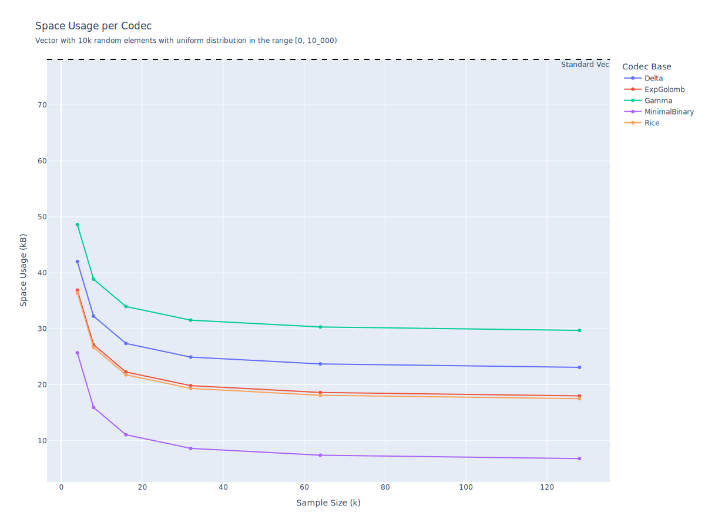
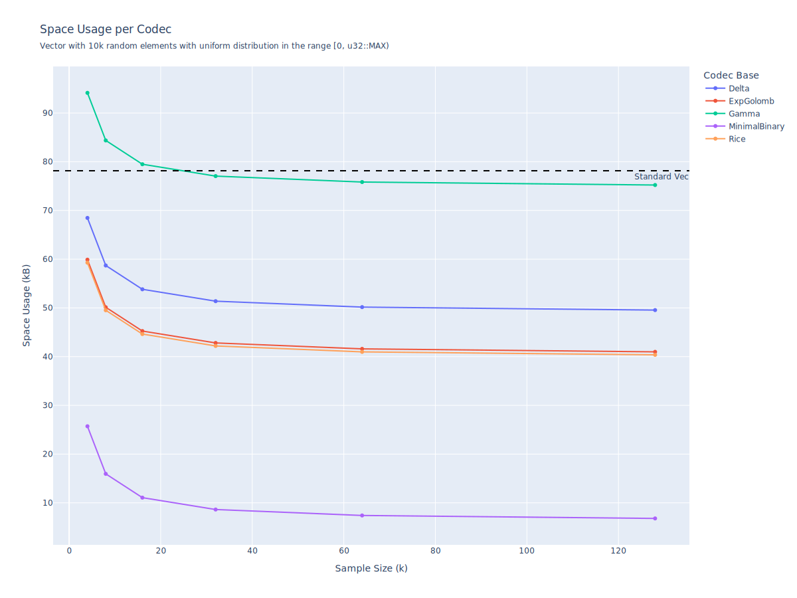
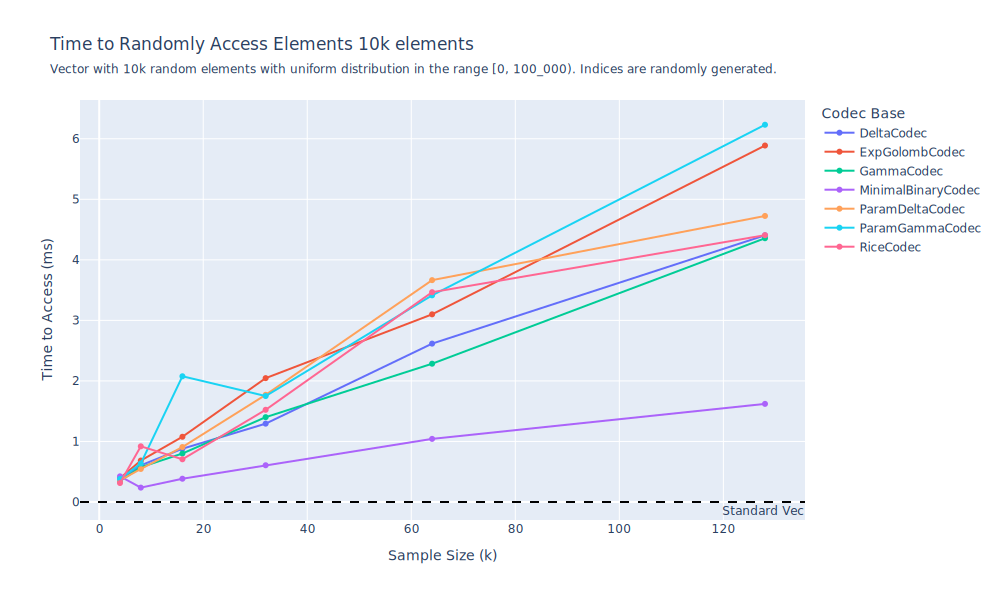

# Compressed Integer Vector Library

[](https://crates.io/crates/compressed-intvec)
[](https://github.com/lukefleed/compressed-intvec/actions/workflows/rust.yml)
[](https://docs.rs/compressed-intvec)
[](https://crates.io/crates/compressed-intvec)


A Rust library for compressing vectors of `u64` integers using instantaneous codes the from [dsi-bitstream](https://docs.rs/dsi-bitstream) library. Offers fast random access via sampling to balance speed and memory. Choose between big-endian (`BEIntVec`) or little-endian (`LEIntVec`) encoding.

## Features

- **Efficient Compression**: Leverage various codecs like Gamma, Delta, and Rice coding.
- **Fast Random Access**: Achieve $O(1)$ access with configurable sampling.
- **Memory Analysis**: Integrate with [`mem-dbg`](https://crates.io/crates/mem-dbg) for memory profiling.
- **Flexible Codecs**: Select codecs based on data distribution for optimal compression.

The sampling parameter determines how often full positions are stored to speed up access. Higher values reduce memory overhead but may increase access time. For example, `sampling_param = 32` is usually a good trade-off for large datasets.

### A Quick Example

Let's consider the _universal_ code **Gamma** introduced by Elias in the 1960s. This code represents an integer as a unary prefix followed by the binary representation of the integer (thus the name universal, as for every integer `x` the length of the code is always $O(\log x)$ long, so just a constant factor longer than its binary form). So for example `9` will be encoded as `0001001`.

```rust
use compressed_intvec::BEIntVec;
use compressed_intvec::codecs::GammaCodec;

let vec = vec![1, 3, 6, 8, 13, 3];

// The compressed-intvec needs a sampling parameter
let sampling_param = 2; // small since the vector is small
let compressed_be = BEIntVec::<GammaCodec>::from(&vec, sampling_param).unwrap();

assert_eq!(compressed_be.get(3), 8);

for (i, val) in compressed_be.iter().enumerate() {
  assert_eq!(val, vec[i]);
}

```

Or alternatively, you can use the `LEIntVec` for little-endian representation:

```rust
use compressed_intvec::LEIntVec;
use compressed_intvec::codecs::GammaCodec;

let vec = vec![1, 3, 6, 8, 13, 3];
let compressed_le = LEIntVec::<GammaCodec>::from(&vec, 2).unwrap();

for (i, val) in compressed.iter().enumerate() {
    assert_eq!(val, vec[i]);
}
```

## Available Codecs

| Codec Name           | Description                                                                                                                                                                                                |
| -------------------- | ---------------------------------------------------------------------------------------------------------------------------------------------------------------------------------------------------------- |
| `GammaCodec`         | Uses gamma coding without requiring extra runtime parameters.                                                                                                                                              |
| `DeltaCodec`         | Uses delta coding, likewise without extra parameters.                                                                                                                                                      |
| `ExpGolombCodec`     | Requires an extra parameter (e.g., a parameter `k`) for encoding/decoding.                                                                                                                                 |
| `ZetaCodec`          | Uses additional runtime parameters ζ.                                                                                                                                                                      |
| `RiceCodec`          | Uses a Rice parameter for encoding/decoding. Ideal for skewed distributions. In this case you may want to set this paramater as the floor of the log_2 of the mean of your values                          |
| `MinimalBinaryCodec` | A minimal binary code with upper bound `u > 0` ([truncated binary encoding](https://en.wikipedia.org/wiki/Truncated_binary_encoding)). This is optimal for uniformly distributed data in the range [0, u). |
| `ParamZetaCodec`     | Parameterized variant of Zeta codec using compile-time flags.                                                                                                                                              |
| `ParamDeltaCodec`    | Parameterized variant of Delta codec using compile-time flags.                                                                                                                                             |
| `ParamGammaCodec`    | Parameterized variant of Gamma codec using compile-time flags.                                                                                                                                             |

For codecs that require extra parameters, we can create a compressed int-vec with the method `from_with_param`:

```rust
use compressed_intvec::BEIntVec;
use compressed_intvec::codecs::RiceCodec;

let vec = vec![1, 3, 6, 8, 13, 3];
let rice_param = 3; // for example
let sampling_param = 2;
let compressed = BEIntVec::<RiceCodec>::from_with_param(&vec, sampling_param, rice_param).unwrap();
```

Choosing the right codec is crucial for achieving optimal compression. The efficiency of a codec is highly dependent on the underlying data distribution. For example, Rice coding is usually effective for skewed distributions, while Minimal Binary coding is optimal for uniformly distributed data.

## Endianness

Choose `BEIntVec` or `LEIntVec` based on data interoperability needs. Performance is equivalent; endianness affects byte order in compressed storage.

## Memory Analysis (and why choosing the right codec is important)

Both the little-endian and big-endian version of the compressed int-vec include support for the [MemDbg/MemSize](https://docs.rs/mem-dbg/) traits from the [mem_dbg](https://crates.io/crates/mem-dbg) crate. For example, this is the output of `mem_dbg(DbgFlags::empty()` for a very large `BEIntVec` instance:

```bash
11536 B ⏺
10864 B ├╴data
  656 B ├╴samples
    0 B ├╴codec
    8 B ├╴k
    8 B ├╴len
    0 B ├╴codec_param
    0 B ╰╴endian
```

Consider now a vector of `u64` values uniformly distributed in the range `[0, u64::MAX)`

```rust
fn generate_uniform_vec(size: usize, max: u64) -> Vec<u64> {
    let mut rng = rand::rngs::StdRng::seed_from_u64(42);
    let uniform = Uniform::new(0, max).unwrap();
    (0..size).map(|_| uniform.sample(&mut rng)).collect()
}
```

The size of the vector before compression is measured as follows:

```rust
let input_vec = generate_uniform_vec(1000, u64::MAX);

println!("Size of the standard Vec<u64>");
input_vec.mem_dbg(DbgFlags::empty());
```

This outputs:

```bash
Size of the standard Vec<u64>
8024 B ⏺
```

Next, we compress the vector using both `MinimalBinaryCodec` and `DeltaCodec` using for both a sampling parameter of `32`:

```rust
let minimal_intvec = BEIntVec::<MinimalBinaryCodec>::from_with_param(&input_vec, 32, 10).unwrap();
let delta_intvec = BEIntVec::<DeltaCodec>::from(&input_vec, 32).unwrap();

println!("Size of the compressed IntVec with MinimalBinaryCodec");
minimal_intvec.mem_dbg(DbgFlags::empty());

println!("\nSize of the compressed IntVec with DeltaCodec");
delta_intvec.mem_dbg(DbgFlags::empty());
```

The compression results are:

```bash
Size of the compressed IntVec with MinimalBinaryCodec
832 B ⏺
528 B ├╴data
280 B ├╴samples
  0 B ├╴codec
  8 B ├╴k
  8 B ├╴len
  8 B ├╴codec_param
  0 B ╰╴endian

Size of the compressed IntVec with DeltaCodec
9584 B ⏺
9288 B ├╴data
 280 B ├╴samples
   0 B ├╴codec
   8 B ├╴k
   8 B ├╴len
   0 B ├╴codec_param
   0 B ╰╴endian
```

As shown, `MinimalBinaryCodec` is the most efficient for uniformly distributed data, reducing the size to 832 bytes, an order of magnitude smaller than the original vector. In contrast, `DeltaCodec` actually increases the size to 9584 bytes, as it is poorly suited for uniform distributions.

## Benchmarks

Benchmarks are provided to evaluate both the random access speed and space occupancy of compressed vectors.

- **Random Access Benchmarks:** These benchmarks measure the time required to access individual elements.
- **Space Occupancy Benchmarks:** These benchmarks report the memory footprint of various codec configurations and compressed representations.

To run the benchmarks, execute:

```bash
cargo bench
```

The results are output to the terminal and also written to CSV files (e.g. `benchmark_space.csv`).

### Space Occupancy



In the first graph, the input is a vector of `10k` random elements uniformly distributed in the range `[0, 10k)`. Here, all codecs outperform the standard vector in terms of space occupancy, but the `MinimalBinaryCodec` clearly wins as it is specifically designed for this type of distribution. However, the other codecs also perform well because the range is small.



In the second graph, the input is the same vector, but the range is `[0, u32::MAX)` (viewed as `u64`). Here, we see that all codecs start to perform poorly, except for `MinimalBinaryCodec`, which continues to be the best. In particular, codecs like Gamma perform worse than the standard vector.

If we were to increase the range even further, all codecs except `MinimalBinaryCodec` would perform worse than the standard vector.

### Random Access



Even though in theory the access of this compressed integer vector is $O(1)$, we can't expect it to be as fast as a standard vector. The performance will be affected by the codec used, the distribution of the data and the sampling parameter. However, the benchmarks show that the performance is still quite good, even for large vectors. Choosing as sample rate a value like `k = 32` seems to be a good trade-off between memory and speed.
